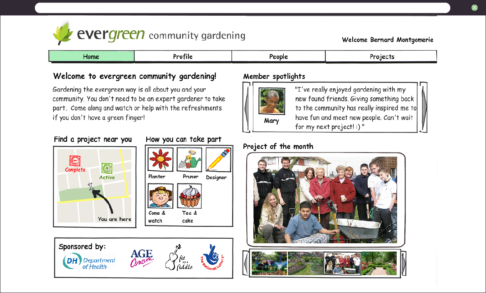
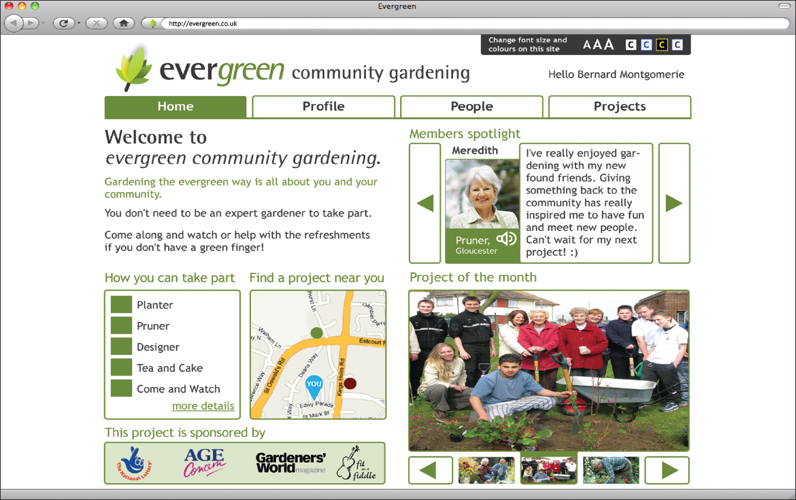

    WIREFRAMES AND HIGH-FIDELITY
    <h2 class="post-title">
        Evergreen
    </h2>
    

    Evergreen was a government-sponsored, social networking website primarily aimed at encouraging elderly people to take part in community-based gardening projects.
    

    
    

