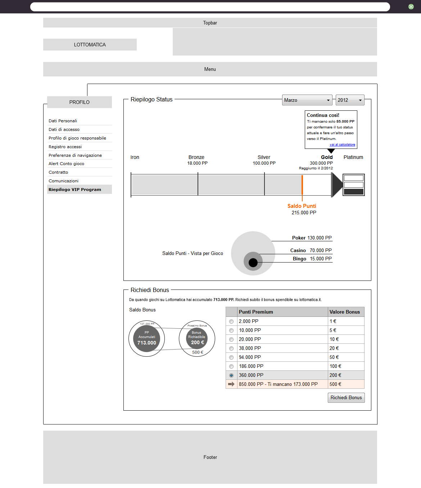
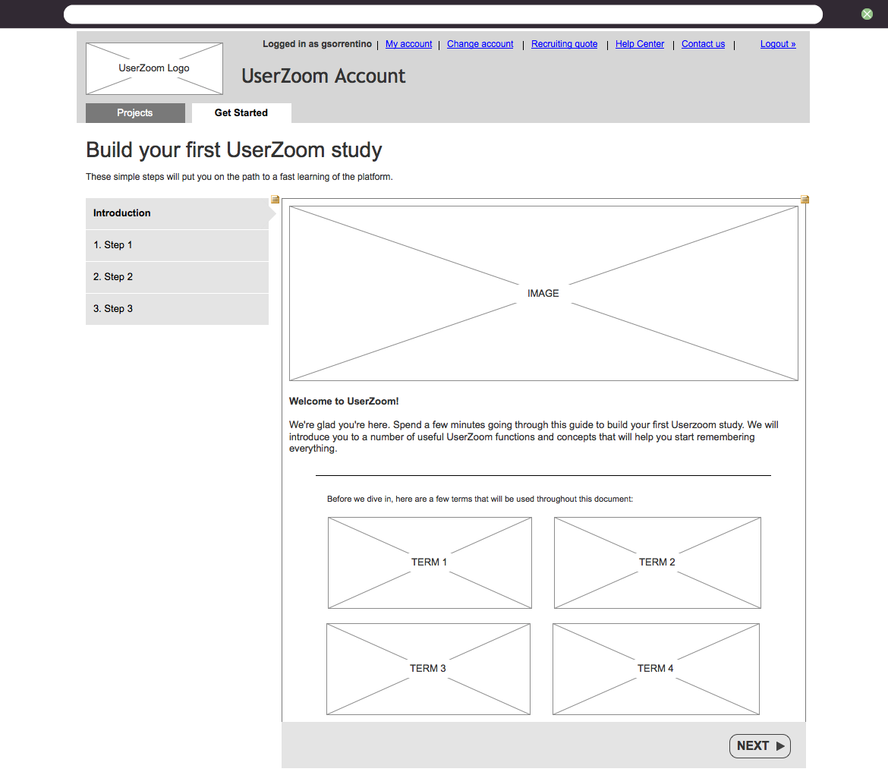
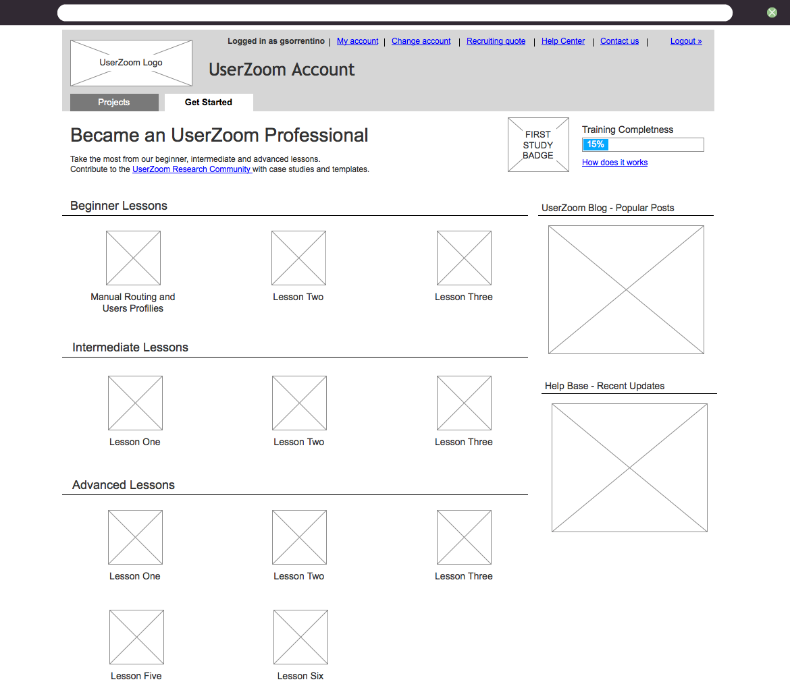
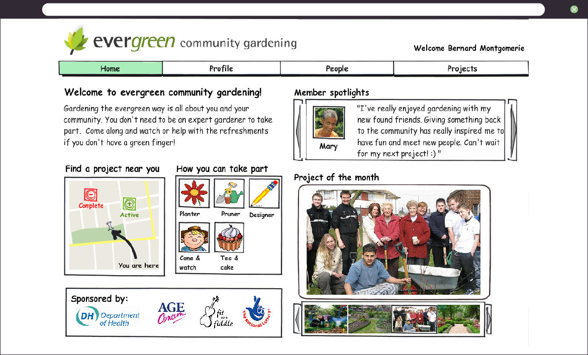
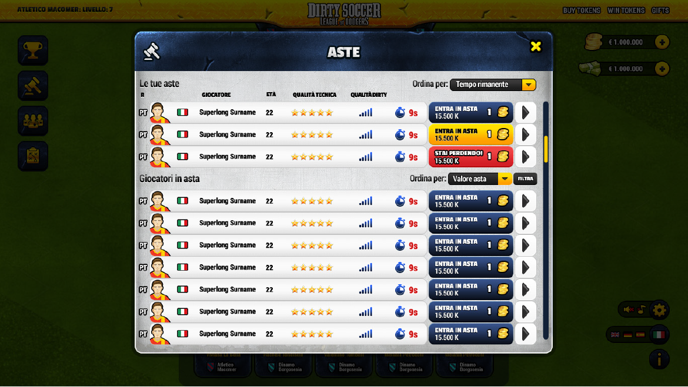
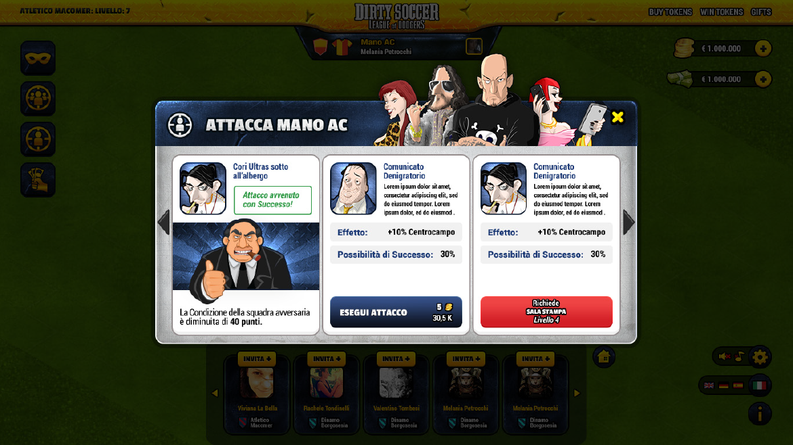

# Portfolio

    
    WIREFRAMES
    
    <h2 class="post-title">
        Lottomatica VIP program
    </h2>
    

    The VIP Program is a big lottomatica effort to reward usual customers any time they play on the site.
    The activity involved the complete redesign of the vip program area including:
        <ol>
            <li>the public area of the site;</li>
            <li>the restricted access area.</li>
        </ol>
    

    
    

    WIREFRAMES
    <h2 class="post-title">
        Userzoom help and support area
    </h2>
    

    The new help and support area for the userzoom platform had the following objectives:
        <ol>
            <li>offer a professional course online;</li>
            <li>integrate and make more acccessible the existing help and support documentation;</li>
            <li>involve and create a userzoom professional community</li>
        </ol>
    The project uses gamication techniques to motivate users to participate, and a sharing platform for userzoom study templates.
    

    
    
    

    WIREFRAMES AND HIGH-FIDELITY
    <h2 class="post-title">
        Evergreen
    </h2>
    

    Evergreen was a government-sponsored, social networking website primarily aimed at encouraging elderly people to take part in community-based gardening projects.
    

    
    

    HIGH-FIDELITY
    <h2 class="post-title">
        Dirty Soccer: League of dodgers
    </h2>
    

    Dirty soccer was a football manager game where you could win also cheating.
    

    
    
    
    

