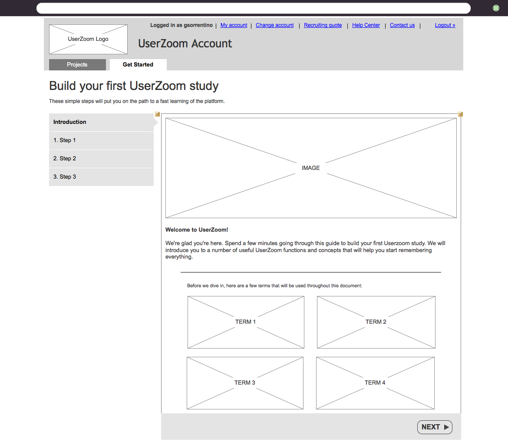
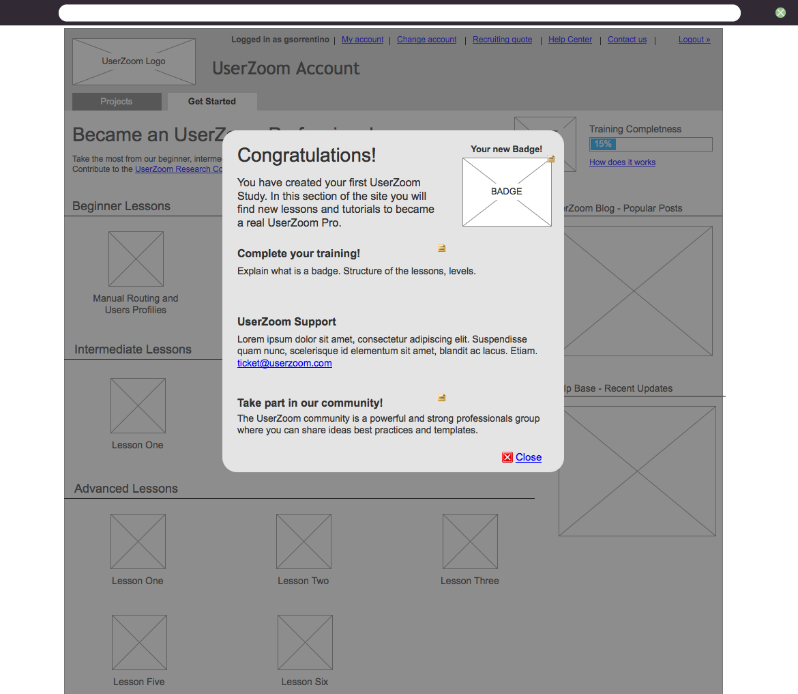
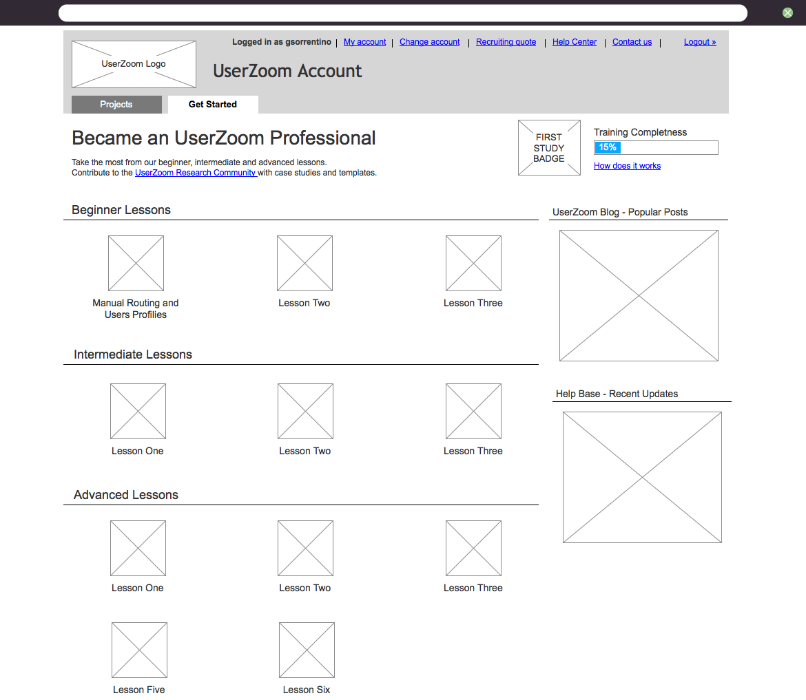

    WIREFRAMES
    <h2 class="post-title">
        Userzoom help and support area
    </h2>
    

    The new help and support area for the userzoom platform had the following objectives:
        <ol>
            <li>offer a professional course online;</li>
            <li>integrate and make more acccessible the existing help and support documentation;</li>
            <li>involve and create a userzoom professional community</li>
        </ol>
    The project uses gamication techniques to motivate users to participate, and a sharing platform for userzoom study templates.
    

    
    
    

